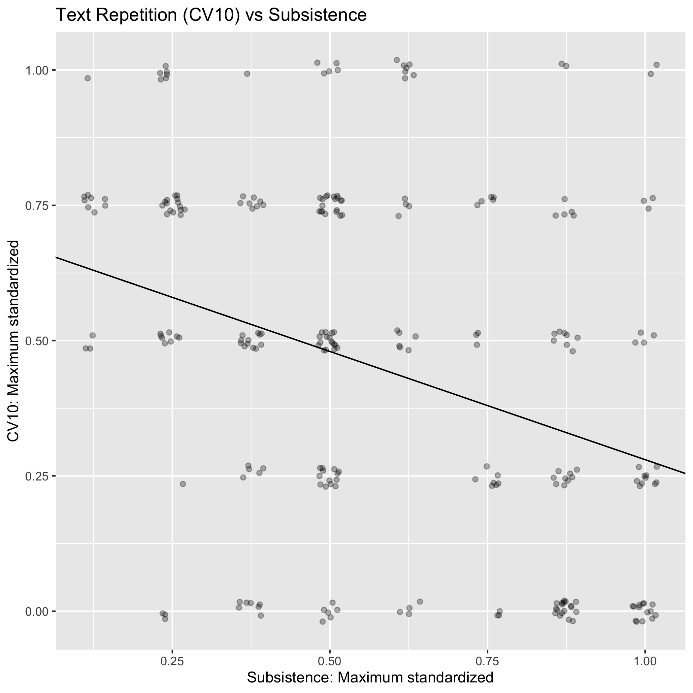
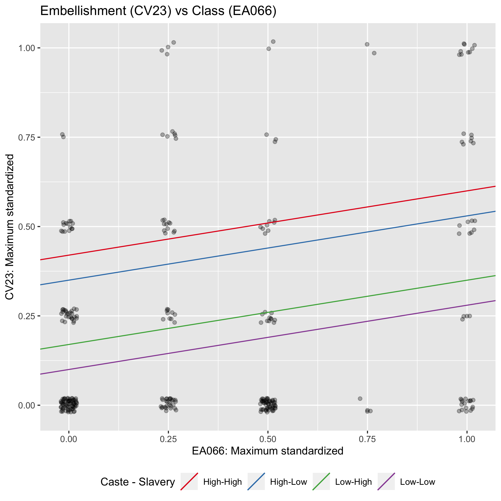
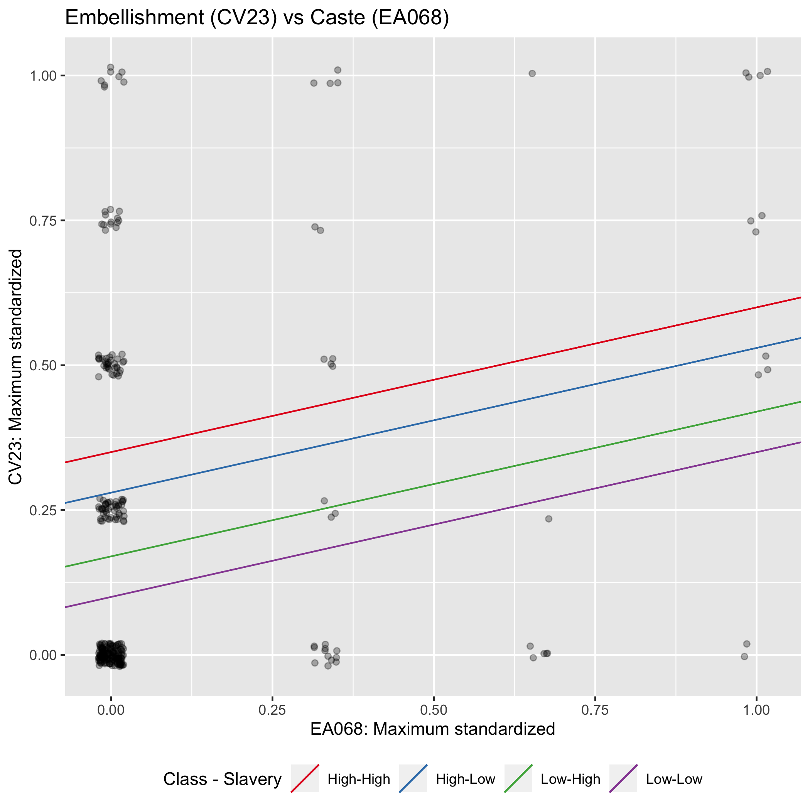
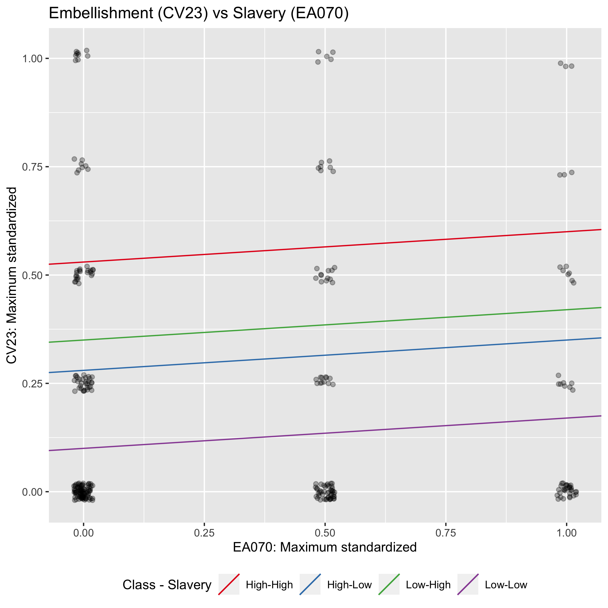

```{r setup, include=FALSE}
knitr::opts_chunk$set(echo = TRUE)
library(VGAM)
library(tidyr)
library(nnet)
library(dplyr)
library(psych)

model_data = read.csv("data/cantometrics_ethnographicatlas.csv")

tt = table(model_data$Language_family)
tt_idx = tt >= 2
model_data = model_data[model_data$Language_family %in% names(tt)[tt_idx],]
```

This document details the modelling procedure used in the paper "The Global Jukebox: A Public Database of Performing Arts and Culture". 
The intention is to describe the results to fellow-co-authors, create discussion of the procedure and results, and identify which sections
can be inserted and adapted into the main manuscript. 
Co-authors chose six relationships to test:


1. Orchestral Social Organisation (Line 3) vs. Jurisdictional hierarchy beyond local community (Ethnographic Atlas: EA033)
2. Text repetition (Cantometrics Line 10) vs. Subsistence (an aggregate variable of numerous Ethnographic variables detailed below)
3. Embellishment (Line 23) vs. Class (EA066), Caste (EA068), and Slavery (EA070) 
4. Melodic interval size (Line 21) vs. Community Size (EA031)
5. Enunciation (Line 37) vs. Jurisdictional hierarchy beyond local community (Ethnographic Atlas: EA033)
6. Latent musical diversity vs. Latent social diversity (both estimated using PCA)

## Data

Data for the musical measures are taken from Cantometrics (available at [https://github.com/theglobaljukebox/cantometrics](https://github.com/theglobaljukebox/cantometrics)), and data on social factors are taken from the Ethnographic Atlas, via D-PLACE (available at [d-place.org](d-place.org)). 
All analysis scripts for this document can be found at [https://github.com/comp-music-lab/global-jukebox](https://github.com/comp-music-lab/global-jukebox)
The creation of the data for these analysis can be found in make_modeldata.R. 

All musical variables are standardized to a 0 - 1 scale using the formula: (code - 1) / (max code value - 1).
The subtraction of one ensures scales start at zero rather than their original minimum coding of 1. 
All social variables are divided by their maximum value, meaning they also exist on a 0-1 scale. 

### Principal Components
We compare the latent variation found in all the 
musical variables in correlations 1-5 to the latent variation 
found in all the social variables in correlations 1-5. To reduce the
variable sets to separate single dimensions we use principal component analysis. 
For each set of  variables (musical or social), we take subset the data to societies who have
data for all variables (i.e. remove societies that have missing values), 
then observe the scree plot to determine a sensible number of principal 
components. Finally, we extract principal components for the 
social and musical data. 

#### Musical PCA
Sub-setting to the musical data, a scree plot reveals that under the Kaiser rule, we could justifiably find two 
principal components (eigenvalue > 1). The Kaiser rule states that a eigenvalue of 1 indicates that a latent variable
explains as much variation as any single variable. The first principal component has an eigenvalue of 1.74, explaining almost
2 variables worth of variation. The second principal component has a eigenvalue of 1.003. 
Since the second variable effectively explains the same amount as any single variable, we opt for using a single principal
component to represent musical diversity. The single musical component explains 34% of diversity.

Below we have the scree plot for the dataset, and the variable loadings for a two and single variable PCA solution.
A two variable solution more explicitly separates variation from Line 3 (Orchestral social organisation) from other variables. 
However, in both the single and two variable solutions, Line 3 has a positive correlation with the latent variable. 

```{r}
musical_complete = model_data %>% 
  dplyr::select(soc_id, line_3, line_10, line_21, line_23, line_37) %>% 
  filter(complete.cases(.))

jpeg("figs/musical_scree.jpeg")
psych::scree(musical_complete[,2:6], factors = FALSE)
dev.off()

musical_pca = psych::principal(musical_complete[,2:6], rotate="varimax", scores = TRUE, nfactors = 2)
musical_pca$loadings

musical_pca = psych::principal(musical_complete[,2:6], rotate="varimax", scores = TRUE, nfactors = 1)
musical_pca$loadings
```


#### Social PCA
A screeplot of the social variables shows that two principal components with eigenvalues > 1 (3.6 & 1.06).
As with the musical variables, the second component is only marginally above 1 (PC2 eigenvalue = 1.06). The loadings of the second
variable show a combination of Caste and Slavery variables, which also load onto the first principal component.
Since this variable does not appear to represent any more information than any single variable, we again opt
to represent social diversity with a single principal component. This single variable explains
around 59% of variation. 

As with the musical PCA, we show a screeplot, and the variable loadings for a two and single variable solution.
A two variable solution creates a second component containing Slavery and Caste variables.

```{r}
social_complete = model_data %>% 
  dplyr::select(soc_id, std_subsistence, std_caste, std_slavery, std_class, 
                std_EA033, std_EA031) %>% 
  filter(complete.cases(.))

jpeg("figs/social_scree.jpeg")
scree(social_complete[,2:7], factors = FALSE)
dev.off()

social_pca = psych::principal(social_complete[,2:7], rotate = "varimax", 
                              scores = TRUE, nfactors = 2, eps=1e-14)
print(social_pca$loadings, cutoff = 0)

social_pca = psych::principal(social_complete[,2:7], rotate = "varimax", 
                              scores = TRUE, nfactors = 1)
social_pca$loadings
```

## Models
### Model data
Table SX shows the summary results for the six hypotheses listed at the 
beginning of this document. The first column of the table indicates the hypotheses.
N shows the number of societies used in the analysis. This count is largely determined by
availability in social data. The next three columns show the beta coefficient and significance 
levels for three model types. Bi-variate shows the relationship between the musical and social 
variables with no controls for common descent or shared ancestry. Language shows the beta coefficient 
between the two variables with a model containing random intercepts for language families. 
Division shows the beta coefficient between the two variables with a model containing random intercepts for 
Geographic areas. Within the Line 23 model, there are three coefficients because there are three 
variables in this model. *** = p < 0.001; ** = p < 0.01; * = [ < 0.05]

#### What are random intercepts?
A simple linear model comes in the form of y = mx + c. In this model, y is the variable we want to predict, 
and x is the variable we are using to predict it. m is a value which indicates the slope of the line between the two variables.
Above I refer to m as beta, which is another common name for the value which determines the slope of the regression line. 
Finally, c is the where that line will cross the Y-axis, also known as the intercept. A model with random intercepts means that
we allow the intercept of the linear model, c, to vary depending on groups within the dataset. In this case, our groups
are either Language family or Geographic Division. For example: The intercept for Indo-European is estimated separately
from the intercept for Bantu. This gives us some idea on whether the relationship to the variables is the same between groups.
An alternative, or additional approach is to have a model with random slopes, which means we let the m value vary by group. 

```{r echo=FALSE}
model_output = read.csv('phylogenetic_analysis/model_table.csv', skip = 1)

knitr::kable(model_output[,1:5], col.names = c("Model", "N", "Bi-variate", "Language family", "Division"))
```

To determine whether the bivariate, Language, or Geographic model fit the data better, we use AIC comparison. 
Under AIC comparison, the smaller the value, the better the models fits the data. 
Model comparisons reveal that in Line 3, Line 10, Line 21, Line 23, and the 
latent variable, a model allowing for variable intercepts by geographical 
region fit the data best. In Line 37, a model allowing for variable intercepts by 
language family fit the data best.

```{r echo = FALSE}
knitr::kable(model_output[,c(1, 6:8)], col.names = c("Model", "Bi-variate", "Language family", "Division"))
```

### Model plots

This section plots the raw data and a regression line for each hypotheses. In all tests,
a model containing random effects fit the data best, meaning there is a separate regression line
for each group. For simplicity, we opt to only plot the regression line for the most populated
group, which is East Africa for the geographic variable, and Indo-European for the language family variable. 
We additonally plot the intercept for all groups as dashes along the Y-Axis (where X = 0). 
As stated above, Line 3, 10, 21, 23, and the latent variable model show a significant influence of 
geographic variation, and line 37 shows significant Linguistic variation. 
Since we do not have the data to estimate varying slopes, the regression lines for all other 
groups are parallel to the plotted line, but cross Y at their respective intercepts. 
Beneath each plot is a brief interpretation of the result. 

### Social organisation of the Orchestra vs Jurisdictional hierarchy

The relationship between Line 3 and EA033 is not significant, suggesting no relationship between these variables. 
Lomax originally predicted as more levels of hierarchy were introduced, Orchestral complexity would also increase. 

{ width=500px; height=400px}

### Text repetition vs Subsistence

We find a significant negative relationship between Line 10 and Subsistence types. 
This suggests that as a reliance on agriculture increases, we see less text repetition within a society, in line
with Lomax' prediction. This relationship is mediated by geographic regions. 
We show the regression line for the most populated region, East Africa. East Africa is a region with an
higher intercept than most other regions (indicated by dashes on the Y-axis). 

{ width=500px; height=400px}

### Interval size vs Community size

We find a significant negative relationship between interval size and community size. 
This suggests that as the size of communities increase, we see a decrease in the 
size of  intervals used, in line with Lomax' predictions. This relationship is mediated by geographic regions. 
There appears to be considerable variability in the geographic intercepts within the model.
This graph displays the regression line for East Africa. 

{ width=500px; height=400px}

### Embellishment vs Class + Caste + Slavery

The next hypotheses we look at is between Embellishment and three measures of
social hierarchy, also known as social layering. A Principal component analyses of these three variables suggested
that they were independent variables, so aggregating them onto a single dimension would be inappropriate. 
Since we have a multi-dimensional model, we present the data in a series of three graphs.
Each graph shows a bivariate relationship between Embellishment and one of the three social variables.
We then plot four regression lines showing the relative impact of the other two variables and different 
strengths of relationship (High levels or low levels). All these relationships are mediated by geographic regions. 
we display regression lines assuming a society within East Africa. Variability in the dashes along the Y-axis suggests
this relationship varies considerably between geographic regions. Note that for Embellishment,
a higher value indicates less Embellishment. 

We find a significant negative relationship between Embellishment and Class. This suggests that
as a society has more levels Class levels, there is more Embellishment. Lomax only explored
this relationship on aggregate, so there is no direct comparison here, however, he had predicted
that embellishments was reflective of stratification. 
We also see a significant influence of the Caste on the relationship between Class and Embellishment.
Note that when there is a high level of Caste differentiation the regression line
drops lower (pink and green line), compared to when there is less caste differentiation (purple and blue).
Changes in rates of slavery however, have little impact. These effects are reflected in
the significant Caste effect and non-significant Slavery effect, which we discuss next.


{ width=500px; height=400px}

We find a significant negative relationship between Embellishment and Caste. This suggests
that as there are caste distinctions, there is more Embellishment. We show lines representing
the variability on the other two variables in the model. Here we see that changes in Class seem to influence
the relationship to some degree, but to a lesser extent that Caste mediated the Class relationship.
Notably, when we compare the strength of the correlation, Caste is approximately twice as strong as Class. 
Slavery again, appears to show no relationship, as will be seen in the next figure.

{ width=500px; height=400px}


We find no significant relationship between Embellishment and slavery, hence
the relative horizontal regression line. 

{ width=500px; height=400px}

### Enunciation vs Jurisdictional hierarchy

We find a significant negative relationship between Enunciation and Jurisdictional hierarchy. 
This suggests that, an increase in the number of hierarchies would show see a softening of enunciation. 
This relationship is mediated by language family, and the regression line assumes an Indo-European society.
However, unlike other models, the variability between linguistic families is moderately less. 


{ width=500px; height=400px}

### Musical PCA vs Social PCA

We find a significant negative relationship between the musical PCA variable and the social PCA variable.
We can interpret the musical variable to represent the cohesiveness and complexity of musical sound. 
A society with a high musical PCA score will have extreme text repetition, little embellishment and 
soft enunciation. Where as a low musical PCA score indicates little repetition, high embellishment and 
precise enunciation. In comparison, a high social PCA score indicates a society that relies on agriculture,
has complex stratification, a large community size, and multiple levels of jurisdictional hierarchy. 
The negative relationship between these two variables suggest music that is more articulated and
ornamented occurs in societies that are larger and have more levels of hierarchy.

{ width=500px; height=400px}


### Data descriptions
This section describes the codes used for all variables in the analyses. 

#### Musical variables

##### Social organisation of the Orchestra (Line 3)

| Code | Description                                                                                                                                                                                                                                                                         |
|:------|:-------------------------------------------------------------------------------------------------------------------------------------------------------------------------------------------------------------------------------------------------------------------------------------|
| 1    | Non-occurrence. No instruments.                                                                                                                                                                                                                                                     |
| 2    | One solo instrument. An accompaniment or a solo on one instrument.                                                                                                                                                                                                                  |
| 4    | Series of solos. One instrumental solo after another.                                                                                                                                                                                                                               |
| 5    | Social unison with leader predominant. Other instruments are subordinate   to the leader, playing the same tune in the same way or in simple   accompanying parts.                                                                                                                  |
| 6    | Social unison with no predominant instrument. Unison performances in   which no single instrument takes the lead, and performances in which there is   a simple accompanying relationship between the leading instrument and the   other instrument(s).                             |
| 7    | Diffuse/individualized relationship, leader predominant. Similar to 7   (ind./var. group) in Line 1, but applied to the relationships among the   instruments of the orchestra. Single lead instrument is predominant.                                                              |
| 8    | Diffuse/individualized relationship, group predominant. Similar to 7   (ind./var. group) in Line 1, but applied to the relationships among the   instruments of the orchestra. Either the leader is subordinate to the group   or leadership shifts from one instrument to another. |
| 9    | Simple alternation: leader-group. A simple antiphonal relationship   between a single lead instrument and an orchestra (see 8 Line 1 alt.   ldr-grp).                                                                                                                               |
| 10   | Simple alternation: group-group. An orchestra divided into two or more   parts with an antiphonal relationship between them.                                                                                                                                                        |
| 11   | Overlapping alternation: leader-group. Alternation between a single   instrument and a group, but with overlap (see 10, Line 1 overlap: ldr-grp).                                                                                                                                   |
| 12   | Overlapping alternation: group-leader. Alternation between a single   instrument and a group with no one instrument in the foreground more often   than the others.                                                                                                                 |
| 13   | Overlapping alternation: group-group. The orchestra is divided into two   or more groups, each of which acts as a unit, with significant overlap   between them, or in an interlocking relationship, as described in Line 1   (13).                                                 |

##### Text repetition (Line 10)

| Code | Description                                                                                                                                                                                                                                                                                                        |
|:-----|:-------------------------------------------------------------------------------------------------------------------------------------------------------------------------------------------------------------------------------------------------------------------------------------------------------------------|
| 1    | Little or no repetition—wordy. A continuous   stream of dissimilar sung syllables, words, and phrases, with little or no   repetition or use of non-lexical utterances. In such songs—epics, ballads,   songs of prayer and supplication, and much of Western and Eurasian song—text   is of paramount importance. |
| 4    | Some repetition. Some repetition and/or the use of non-lexical   utterances—about one fourth repeated text.                                                                                                                                                                                                        |
| 7    | Half repetition. A substantial amount of repetition and/or non-lexical   utterances that more or less equals the flow of unrepeated words.                                                                                                                                                                         |
| 10   | Quite repetitious. Considerably more than half (about two-thirds) of the   sung performance is accounted for by repetition and/or non-lexical   utterances.                                                                                                                                                        |
| 13   | Extreme repetition. The text seems to be almost entirely composed of   repetition of some kind and/or non-lexical utterances.                                                                                                                                                                                      |

##### Melodic Interval size (Line 21)

| Code | Description                                                                                                                                                            |
|:-----|:-----------------------------------------------------------------------------------------------------------------------------------------------------------------------|
| 1    | Monotone. No intervals occur. The song   remains on approximately one pitch. A polyphonic song would be coded   “monotone” if each part stays at the same pitch level. |
| 4    | Narrow intervals. Intervals of a half step or less are prominent (though   not necessarily predominant) in the song.                                                   |
| 7    | Diatonic intervals. Diatonic melodies where whole step predominates.                                                                                                   |
| 10   | Large intervals. Intervals of a third occur more frequently than other   intervals.                                                                                    |
| 13   | Very large intervals. Intervals of a fourth and a fifth or larger   predominate.                                                                                       |

##### Embellishment (Line 23)

| Code | Description                           |
|:-----|:--------------------------------------|
| 1    | Extreme embellishment.                |
| 4    | Much embellishment.                   |
| 7    | Medium or considerable embellishment. |
| 10   | Slight embellishment.                 |
| 13   | Little or no embellishment.           |

##### Enunciation (Line 37)

| Code | Description                                                                                                                                                                          |
|:-----|:-------------------------------------------------------------------------------------------------------------------------------------------------------------------------------------|
| 1    | Very precise enunciation. Highly articulated   consonants and syllables. This is generally typical of the storytelling   singers of Eurasian polities.                               |
| 4    | Precise enunciation. Clearly articulated consonants in sung texts. Here   one listens to the whole consonantal range and makes certain that all   consonants are easily discernible. |
| 7    | Moderate enunciation. A moderate degree of enunciation.                                                                                                                              |
| 10   | Softened enunciation. Consonants are hard to distinguish and syllables   are run together to some degree.                                                                            |
| 13   | Very softened enunciation. Situations in which consonants are absent or   nearly absent from the text, and/or in which syllables are run together.                                   |

#### Social variables 

##### Jurisdictional hierarchy beyond local community (EA033)

| Code | Description                                                                   |
|:------|:------------------------------------------------------------------------------|
| 1     | No political authority beyond community (e.g., autonomous bands and villages) |
| 2     | One level (e.g., petty chiefdoms)                                             |
| 3     | Two levels (e.g., larger chiefdoms)                                           |
| 4     | Three levels (e.g., states)                                                   |
| 5     | Four levels (e.g., large states)                                              |

##### Subsistence

| Code | Description                                                                                                             | Original Lomax Scale                                                                                                                                                                                                                                                | Revised scale                                                                                                                                                                                                                                                        |
|:-----|:------------------------------------------------------------------------------------------------------------------------|---------------------------------------------------------------------------------------------------------------------------------------------------------------------------------------------------------------------------------------------------------------------|----------------------------------------------------------------------------------------------------------------------------------------------------------------------------------------------------------------------------------------------------------------------|
| 1    | Collecting outweighs game producing and agriculture                                                                     | (EA004 < 4 and EA005 < 4 and EA004 + EA005 < 6 and the greatest value of (E001, E002, E003) > the greater value of (EA004, EA005)) and either (EA001 $\ge$ 4 and EA001 $\ge$ EA002 and EA003 - EA001 $\le$ 1) or (EA001 < 4 and EA001 > EA002 > EA003 or EA001 > EA003 > EA002) | (EA004 < 4 and EA005 < 4 and EA004 + EA005 < 6 and the greatest value of (E001, E002, E003) > the greater value of (EA004, EA005)) and either (EA001 $\ge$ 4 and EA001 $\ge$ EA002 and EA003 - EA001 $\le$ 1) or (EA001 < 4 and EA001 > EA002 > EA003 or EA001 > EA003 > EA002 ) |
| 2    | Hunting and/or fishing outweigh collection and/or agriculture                                                           | (EA004 < 4 and EA005 < 4 and EA004 + EA005 < 6 and the greatest value of (E001, E002, E003) > the greater value of (EA004, EA005)) and does not satisfy the conditions for 1                                                                                      | (EA004 < 4 and EA005 < 4 and EA004 + EA005 < 6 and the greatest value of (E001, E002, E003) > the greater value of (EA004, EA005)) and does not satisfy the conditions for 5_1                                                                                       |
| 3    | Planters (prior to European contact) with simple tools and no large domestic animals                                    | Does not satisfy conditions for 1, 2, 3, 4, 5, 6, 7, or 8.                                                                                                                                                                                                          | EA040=1-3 and EA005>4 and EA028 =3 or EA040-1-2 and EA005>4 and EA003<3 and EA028=4 [this adds horticulturalists with no animals, or only pigs] to this category to distinguish them from horticulturalists in category 6 and category 4.                            |
| 4    | Cultivators with simple tools and animal husbandry (goats, sheep, horses, deer, camels, yaks, water buffalo, or cattle) | (EA040 > 1 and EA005 > 0) and either (EA028 = 4, 5, or 6 and EA039 $\neq$ 3) or (EA028 = 3).                                                                                                                                                                             | (EA040 > 2 and EA005 > 4) and either (EA028 = 5 and EA039 $\neq$ 3) or (EA028 = 3) or (EA028=4 and EA003<3)                                                                                                                                                               |
| 5    | Full nomadic pastoralism, at least 70% dependent on animal husbandry                                                    | EA004 > 5 and EA005 < 3                                                                                                                                                                                                                                             | EA004 > 5 and EA005 < 3                                                                                                                                                                                                                                              |
| 6    | Horticulture with fishing, tree cultivation, animal husbandry, and ocean fishing                                        | EA040 > 1 and EA003 > 2 and EA028 = 4                                                                                                                                                                                                                               | EA040 > 1 and EA003 > 2 and EA028 = 4 and EA005 > 4                                                                                                                                                                                                                  |
| 7    | Plough agriculture                                                                                                      | EA028 = 5 and EA039 = 3 and EA040 = 3 or 7 and EA005 > (EA004)/2                                                                                                                                                                                                    | EA028 = 5 and EA039 = 3 and EA040 = 3 or 7 and EA005 > 4                                                                                                                                                                                                             |
| 8    | Irrigation                                                                                                              | EA028 = 6 and EA039 = 3 and EA040 = 3 or 7                                                                                                                                                                                                                          | EA028 = 6 and EA039 = 3 and EA040 = 3 or 7 and EA005 > 4                                                                                                                                                                                                             |


##### Class (EA066)

| Code | Description                                                                                                                                                                                                                                      |
|:-----|:-------------------------------------------------------------------------------------------------------------------------------------------------------------------------------------------------------------------------------------------------|
| 1    | Absence of significant class distinctions   among freemen (slavery is treated in EA070), ignoring variations in   individual repute achieved through skill, valor, piety, or wisdom                                                              |
| 2    | Wealth distinctions, based on the possession or distribution of property,   present and socially important but not crystallized into distinct and   hereditary social classes                                                                    |
| 3    | Elite stratification, in which an elite class derives its superior status   from, and perpetuates it through, control over scarce resources, particularly   land, and is thereby differentiated from a property-less proletariat or serf   class |
| 4    | Dual stratification into a hereditary aristocracy and a lower class of   ordinary commoners or freemen, where traditionally ascribed noble status is   at least as decisive as control over scarce resources                                     |
| 5    | Complex stratification into social classes correlated in large measure   with extensive differentiation of occupational statuses                                                                                                                 |

##### Caste (EA068)

| Code | Description                                                                                                                                                                                                                                                                                                                                                         |
|:-----|:--------------------------------------------------------------------------------------------------------------------------------------------------------------------------------------------------------------------------------------------------------------------------------------------------------------------------------------------------------------------|
| 1    | Caste distinctions absent or insignificant                                                                                                                                                                                                                                                                                                                          |
| 2    | One or more despised occupational groups, e.g., smiths or leather   workers, distinguished from the general population, regarded as outcastes by   the latter, and characterized by strict endogamy                                                                                                                                                                 |
| 3    | Ethnic stratification, in which a superordinate caste withholds   privileges from and refuses to intermarry with a subordinate caste (or   castes) which it stigmatizes as ethnically alien, e.g., as descended from a   conquered and culturally inferior indigenous population, from former slaves,   or from foreign immigrants of different race and/or culture |
| 4    | Complex caste stratification in which occupational differentiation   emphasizes hereditary ascription and endogamy to the near exclusion of   achievable class statuses                                                                                                                                                                                             |

##### Slavery (EA070) 
 
| Code | Description                                                                                                                |
|:-----|:---------------------------------------------------------------------------------------------------------------------------|
| 1    | Absence or near absence of slavery                                                                                         |
| 2    | Incipient or nonhereditary slavery, i.e., where slave status is temporary   and not transmitted to the children of slaves  |
| 3    | Slavery reported but not identified as hereditary or nonhereditary                                                         |
| 4    | Hereditary slavery present and of at least modest social significance                                                      |
 
##### Community Size (EA031)

| Code | Description                                                                                |
|:-----|:-------------------------------------------------------------------------------------------|
| 1    | Fewer than 50 persons                                                                      |
| 2    | From 50 to 99 persons                                                                      |
| 3    | From 100 to 199 persons                                                                    |
| 4    | From 200 to 399 persons                                                                    |
| 5    | From 400 to 1,000 persons                                                                  |
| 6    | More than 1,000 persons in the absence of indigenous urban aggregations                    |
| 7    | One or more indigenous towns of more than 5,000 inhabitants but none of   more than 50,000 |
| 8    | One or more indigenous cities with more than 50,000 inhabitants                            |

